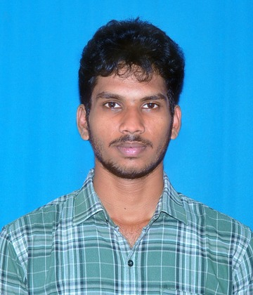

# 💻 Boyapati Venkata Suraj — Personal Portfolio

<p align="center">
  
</p>

<h3 align="center">Full Stack Developer & DevOps Enthusiast</h3>

<p align="center">
  A modern, responsive personal portfolio website showcasing my skills, projects, certifications, and development journey.
</p>

<p align="center">
  <a href="https://s24uraj.github.io/Portfolio-Website/">
    🌐 Live Portfolio
  </a>
  •
  <a href="https://github.com/S24uraj">
    GitHub
  </a>
  •
  <a href="https://www.linkedin.com/in/venkata-suraj-boyapati-11010725b">
    LinkedIn
  </a>
</p>

---

## 👨‍💻 About Me

I'm **Boyapati Venkata Suraj**, a Computer Science Engineering student and aspiring **Full Stack Developer** with an interest in **DevOps and Cloud Technologies**.

I enjoy building responsive web applications, exploring modern software development technologies, and turning ideas into practical solutions.

Currently, I am focused on strengthening my **Java Full Stack Development** skills while expanding my knowledge of **DevOps, Cloud, CI/CD, and deployment technologies**.

---

## 🌐 Live Website

🔗 **Portfolio:**  
https://s24uraj.github.io/Portfolio-Website/

The portfolio is deployed using **GitHub Pages** and is accessible publicly.

---

## ✨ Features

- 🎨 Modern dark-themed UI
- 📱 Fully responsive design
- 👨‍💻 About Me section
- 🛠️ Technical Skills section
- 🚀 Projects showcase
- 📜 Certificates section
- 📄 Resume section
- 📬 Contact & social links
- 🤖 Interactive coding assistant robot
- 💻 Animated programming-themed background
- ⚡ Smooth scrolling and interactive elements
- 🌐 Hosted using GitHub Pages

---

## 🛠️ Technologies Used

### Frontend

- HTML5
- CSS3
- JavaScript

### Programming

- Java
- Python
- JavaScript

### Web Development

- HTML
- CSS
- JavaScript
- React
- Spring Boot
- REST APIs

### Database

- MySQL
- PostgreSQL
- MongoDB

### DevOps & Cloud

- Git
- GitHub
- Docker
- Jenkins
- GitHub Actions
- CI/CD
- AWS
- Linux

---

## 🚀 Projects

### 🚗 Real-Time Accident Monitoring & Risk Prediction

An AI and IoT-based system designed to detect road accidents in real time and predict potential accident risks.

**Technologies:**

- Python
- YOLOv8
- CNN
- IoT
- ESP32

---

### 🎬 Netflix Clone

A responsive Netflix-inspired frontend project created to practice modern web development concepts and responsive UI design.

**Technologies:**

- HTML5
- CSS3
- JavaScript

---

### 🛒 E-Commerce Website

A responsive e-commerce website developed to demonstrate frontend development and interactive web design concepts.

**Technologies:**

- HTML5
- CSS3
- JavaScript

---

## 📜 Certifications & Experience

### 📊 Data Science & Analytics Internship — Future Interns

Completed a Data Science & Analytics internship involving practical work in:

- Tableau
- Power BI
- Excel
- Python
- Data Analysis
- Business Analytics
- E-Commerce Analytics
- Marketing Funnel Analysis
- Retention Analysis

---

## 🎓 Education

**Bachelor of Technology — Computer Science Engineering**

**Dhanekula Institute of Engineering and Technology**  
JNTUK — R20 Regulation

---

## 📂 Project Structure

```text
Portfolio-Website/
│
├── index.html
├── style.css
├── script.js
│
├── assets/
│   ├── images/
│   │   └── p1.jpg.jpg
│   │
│   ├── resumes/
│   │   └── resume
│   │
│   └── Certificates/
│       └── Internship Certificate.pdf
│
└── README.md
